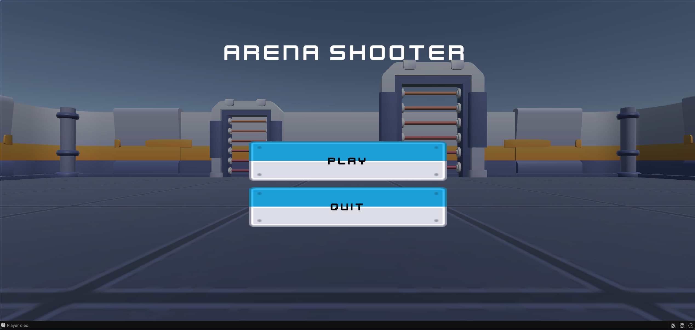
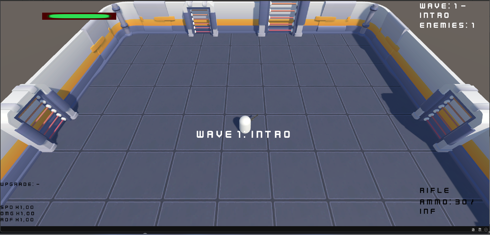
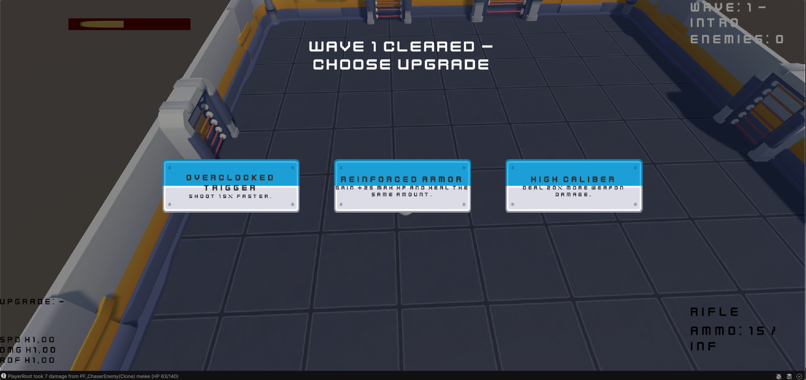
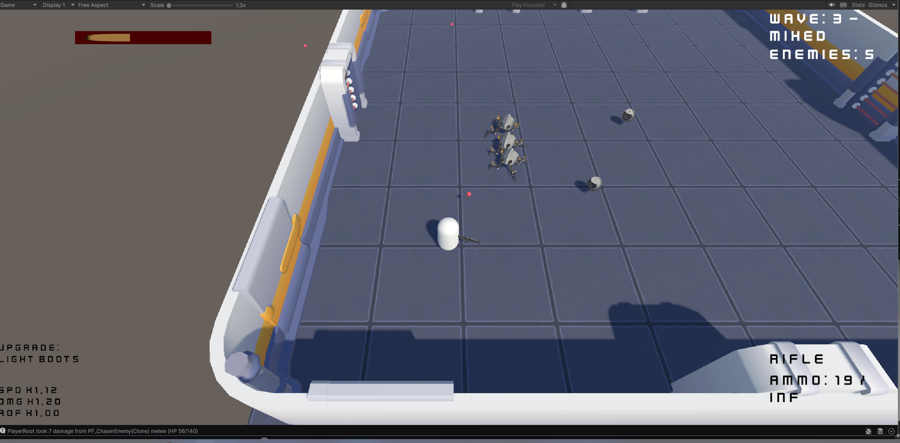

# Arena Shooter 3D

Top-down sci-fi arena shooter built in Unity 6. The project focuses on a clean gameplay loop: survive waves, choose upgrades, fight a boss, and finish a short run.

## Download

- [Windows Build (latest release)](https://github.com/sasha2281337/arena-shooter-3d/releases/latest)

## Screenshots

## Core Features

- Top-down character controller with mouse aim
- Rifle and shotgun with ammo, reload, and weapon switching
- Multiple enemy roles:
  - Chaser
  - Ranged
  - Tank
  - Boss
- Authored wave progression
- Between-wave upgrade selection
- Player HUD, pause, game over, and victory states
- Main menu and return-to-menu flow
- Audio feedback for weapons, UI, spawn gates, damage, and run states
- Procedural enemy motion/attack animation for low-poly robot enemies

## Controls

- `WASD` move
- `Mouse` aim
- `Left Mouse Button` fire
- `R` reload
- `1` equip rifle
- `2` equip shotgun
- `Esc` pause / resume

## Scenes

- `Assets/Scenes/MainMenu.unity`
- `Assets/Scenes/ArenaPrototype.unity`

`MainMenu` is the entry scene. `ArenaPrototype` is the playable run.

## Project Structure

- `Assets/_Project/Scripts` gameplay code
- `Assets/_Project/Prefabs` enemy and gameplay prefabs
- `Assets/_Project/ScriptableObjects` weapons, upgrades, and waves
- `Assets/_Project/Art` imported third-party art assets and UI
- `Assets/_Project/Audio` imported sound assets

## Tech Notes

- Unity 6
- Input System package
- Built-in 3D workflow
- Single-scene gameplay setup with ScriptableObject-driven weapons, upgrades, and authored waves

## Third-Party Assets

This project uses third-party art, UI, audio, and model assets imported during development.

- `THIRD_PARTY_ASSETS.md` lists the packs currently used in the project.
- Before public redistribution, review the original asset pack licenses and attribution requirements for every imported pack.

## Status

This is a portfolio vertical slice, not a content-complete game. The current focus is gameplay clarity, encounter structure, and a presentable end-to-end playable loop.
